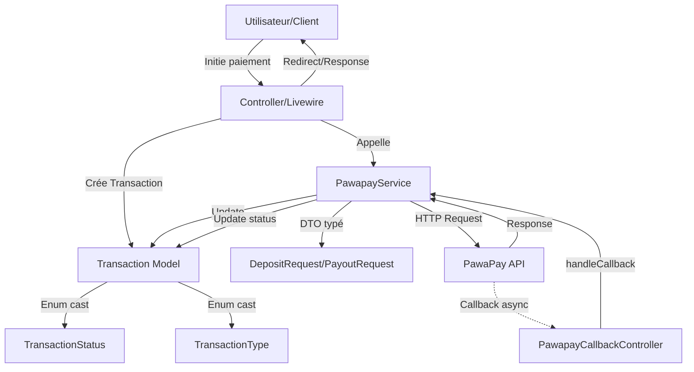
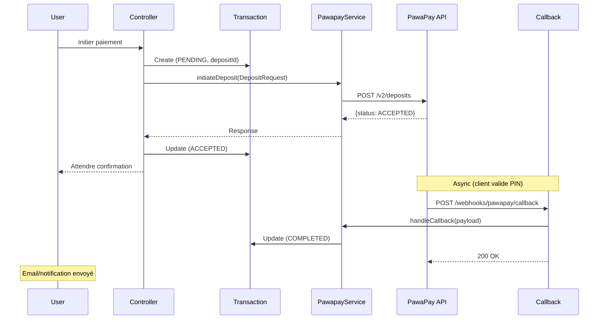
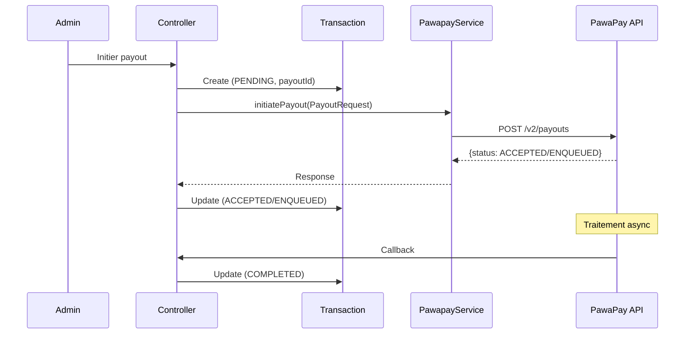
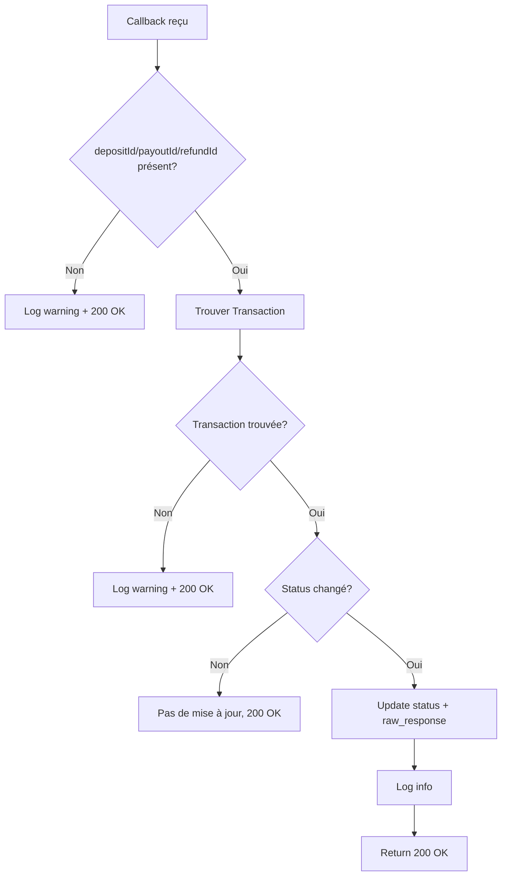

# Architecture de l'intégration PawaPay

## Vue d'ensemble

L'intégration PawaPay suit une architecture moderne et maintenable utilisant les meilleures pratiques Laravel.

## Diagramme de flux



## Composants principaux

### 1. Configuration Layer
```
config/pawapay.php
├── Base URL (sandbox/production)
├── API Token
├── Default currency
├── Available providers
├── Callback URL
└── Timeouts & retries
```

### 2. Data Layer

#### Enums (PHP 8)
```php
TransactionStatus
├── PENDING
├── SUBMITTED
├── ACCEPTED
├── COMPLETED ✅
├── FAILED ❌
├── ENQUEUED
├── CANCELLED
├── DUPLICATE_IGNORED
└── REJECTED

TransactionType
├── DEPOSIT (client → vous)
├── PAYOUT (vous → client)
└── REFUND (remboursement)
```

#### DTOs (Data Transfer Objects)
```php
DepositRequest
├── depositId: string (UUID)
├── phoneNumber: string
├── provider: string
├── amount: string
├── currency: string
├── clientReferenceId?: string
├── customerMessage?: string
├── metadata?: array
└── toArray(): array

PayoutRequest
├── payoutId: string (UUID)
├── phoneNumber: string
├── provider: string
├── amount: string
├── currency: string
└── toArray(): array

RefundRequest
├── refundId: string (UUID)
├── depositId: string
├── amount?: string
└── toArray(): array
```

#### Model
```php
Transaction
├── transaction_id (UUID, PK)
├── user_id
├── type: TransactionType
├── status: TransactionStatus
├── amount: int (centimes)
├── deposit_id?: string (UUID)
├── payout_id?: string (UUID)
├── refund_id?: string (UUID)
├── provider?: string
├── currency?: string
└── raw_response?: array

Relations
├── user(): BelongsTo
├── visitPass(): BelongsTo
└── rentPayment(): BelongsTo

Scopes
├── deposits()
├── payouts()
├── refunds()
├── completed()
├── pending()
└── failed()

Accessors
├── is_completed: bool
├── is_pending: bool
├── is_failed: bool
├── pawapay_id: string
└── failure_reason: string
```

### 3. Service Layer

```php
PawapayService
├── Deposits
│   ├── initiateDeposit(DepositRequest): array
│   ├── getDepositStatus(depositId): array
│   ├── createPaymentPage(...): array
│   └── resendDepositCallback(depositId): array
│
├── Payouts
│   ├── initiatePayout(PayoutRequest): array
│   ├── getPayoutStatus(payoutId): array
│   ├── cancelPayout(payoutId): array
│   └── resendPayoutCallback(payoutId): array
│
├── Refunds
│   ├── initiateRefund(RefundRequest): array
│   ├── getRefundStatus(refundId): array
│   └── resendRefundCallback(refundId): array
│
├── Toolkit
│   ├── predictProvider(phoneNumber): array
│   ├── getActiveConfiguration(): array
│   ├── getAvailability(): array
│   └── normalizePhoneNumber(phone): string
│
└── Webhooks
    └── handleCallback(payload): Transaction|null
```

### 4. HTTP Layer

#### Controller
```php
PawapayCallbackController
└── handle(Request): JsonResponse
    ├── Log callback
    ├── Verify signature (optionnel)
    ├── Call PawapayService::handleCallback()
    ├── Update transaction
    └── Return 200 OK (rapide)
```

#### Route
```php
POST /webhooks/pawapay/callback
├── No CSRF protection
├── No authentication
└── Public endpoint
```

### 5. Exception Layer
```php
PawaPayException extends Exception
├── message: string
├── statusCode?: int
└── responseBody?: string
```

## Flux de données

### Deposit (collecte de paiement)



### Payout (envoi d'argent)



### Callback handling (idempotent)



## Principes de conception

### 1. Idempotence
- ✅ Callbacks peuvent arriver plusieurs fois
- ✅ depositId/payoutId/refundId générés AVANT l'appel API
- ✅ Pas de double mise à jour si status inchangé
- ✅ DUPLICATE_IGNORED géré proprement

### 2. Type Safety
- ✅ Enums pour statuts et types (pas de magic strings)
- ✅ DTOs pour requêtes (autocomplete IDE)
- ✅ PHPDoc complet sur toutes les méthodes
- ✅ Return types stricts

### 3. Error Handling
- ✅ Exception dédiée (PawaPayException)
- ✅ Logs détaillés de chaque erreur
- ✅ Pas de fail silencieux
- ✅ Status PENDING ne devient jamais FAILED sur erreur réseau

### 4. Separation of Concerns
- ✅ Service = logique métier PawaPay
- ✅ Controller = HTTP/callbacks
- ✅ Model = persistence
- ✅ DTOs = structure de données

### 5. Testability
- ✅ HTTP faking pour isolation
- ✅ Pas de dépendances externes hardcodées
- ✅ Injection de dépendances
- ✅ 52 tests couvrant tous les cas

## Patterns utilisés

### DTO Pattern
```php
// ❌ Avant (array associatif)
$data = ['depositId' => $id, 'amount' => $amt, ...];

// ✅ Maintenant (DTO typé)
$request = new DepositRequest($id, $phone, $provider, $amt, ...);
```

### Enum Pattern
```php
// ❌ Avant (string)
if ($transaction->status === 'completed') { ... }

// ✅ Maintenant (enum)
if ($transaction->status === TransactionStatus::COMPLETED) { ... }
if ($transaction->status->isFinal()) { ... }
```

### Repository Pattern (via Eloquent)
```php
Transaction::deposits()->completed()->get()
Transaction::where('deposit_id', $id)->firstOrFail()
```

### Service Pattern
```php
// Toute la logique PawaPay isolée dans PawapayService
app(PawapayService::class)->initiateDeposit($request);
```

## Sécurité

### Tokens
- ✅ Jamais exposés côté client
- ✅ En variable d'environnement
- ✅ Différents sandbox/production

### Callbacks
- ✅ Route publique (pas de CSRF)
- ✅ Idempotence (protection replay)
- ✅ Signature vérifiable (RFC-9421, optionnel)
- ✅ Logs de tous les callbacks

### Validation
- ✅ Provider prediction avant paiement
- ✅ Normalisation des numéros
- ✅ Montants en string (pas de float)
- ✅ Statut toujours vérifié dans la réponse

## Performance

### Caching
- ❌ Pas de cache actuellement (API rapide)
- ✅ Possibilité de cacher activeConfiguration (TTL court)

### Queues
- ✅ Callbacks répondent 200 immédiatement
- ✅ Traitement lourd peut être queued si besoin

### Retry
- ✅ Retry automatique configuré (2x par défaut)
- ✅ Timeout 30s par défaut
- ✅ Pas de retry sur rejet métier

## Monitoring

### Logs
```php
Log::info('PawaPay deposit initiated', ['depositId' => ...]);
Log::warning('PawaPay deposit rejected', ['failureReason' => ...]);
Log::error('PawaPay API error', ['status' => ..., 'body' => ...]);
```

### Métriques suggérées
- Taux de succès par provider
- Délai moyen callback → update
- Nombre de rejets par failureCode
- Montant total par période

---

**Architecture claire, testée, et maintenable ! 🏗️**
